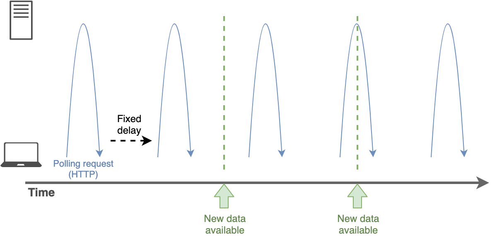
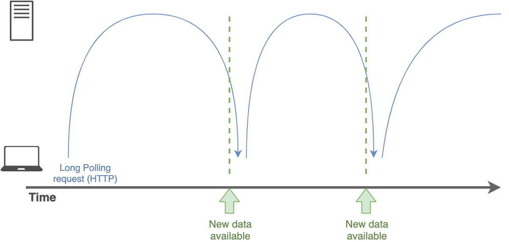
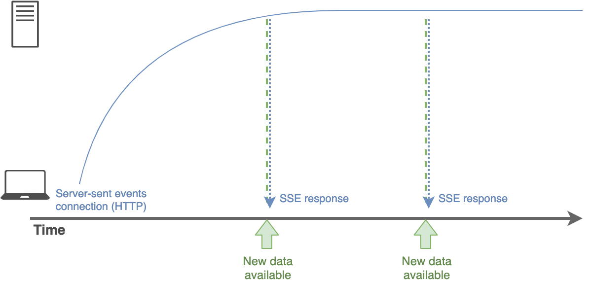
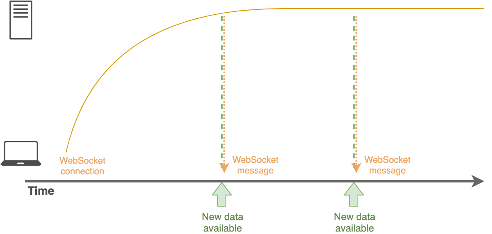
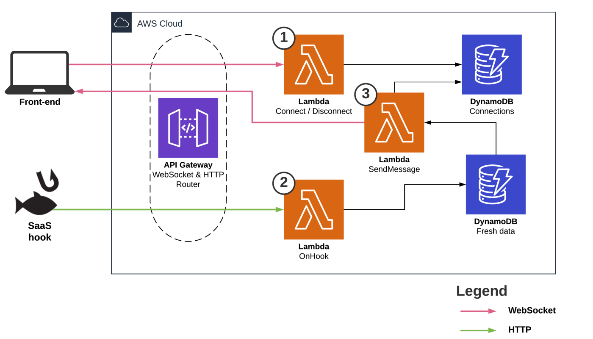

# Asyncronous Communication Methods
This guide has the objective to show the difference between the most common methods of asynchronous communication, as well to show how to implement them.

## (Long) Polling (Server-to-Browser Comunication)

Your front-end has the responsibility of regularly asking your back-end if there is any fresh data. Hence the front will make the same call every few seconds/minutes. Sometimes one of those calls will have a fresh data to handle. Latency is increased, as the front-end has to wait for the next pool to get the most updated data. Bandwidth is increased, as the front-end creates lots of requests (requests contain data) to the back-end even when there is no data for the back-end to return, which is waste.

Long polling is different in the fact that the request is kept open by the server as long as possible until it eventually returns a fresh data or reaches a timeout.

Example Architecture:

## Server-Sent Events (Server-to-Browser Communication)

Your front-end opens a long-lasting, uni-directional communication from your back-end to your front-end through the HTTP protocol. Here as well, the back-end can push a message as soon as necessary. If you want browser to server communication, you'll need do make a separated POST request.

Best use cases: Stock prices updates, notifications, anything that needs uni-directional communication.

Example Architecture:

## WebSocket (Server-to-Browser and Browser-to-Server Communication)

Your front-end opens a long-lasting, bi-directional communication with your back-end through a WebSocket protocol. Thus, the back can push a message as soon as necessary and vice versa. Latency and Bandwidth are decreased, as the data will be exchanged exactly when it's available.

This is the only standard and official solution supported by AWS.

Best use cases: Google Wave type of applications, chat applications, anything that needs bi-directional communication.

Performance: As your server could have thousands or millions of open sockets, that could be a problem, but open sockets don't impact too much on CPU usage, being the Memory the main resource used. [Here](https://stackoverflow.com/questions/17448061/how-many-system-resources-will-be-held-for-keeping-1-000-000-websocket-open) we have a report of a modest server (8 vCPU and 68.4 GiB) taking up to 500k open socket connections.

Example Architecture:

1. Start and keep track of the live WebSocket connection.
2. An event, like a SaaS hook, triggers a DB update.
3. A DynamoDB event then triggering a Lambda to notify the front-end of the updated data.

## Webhooks (Server to Server Communication)

Example Architecture:

## ~~HTTP/2 Push (Server-to-Browser Communication)~~ :skull:	

Developers from Chromium removed the support for this feature due to low usage and high maintenance cost. As Chrome has 70% of market share (2022), they are effectively killing HTTP/2 Push. As HTTP/2 Push is not mandatory, Chromium keeps being HTTP/2 compliant.

Chromium Team announcement (2021): https://groups.google.com/a/chromium.org/g/blink-dev/c/K3rYLvmQUBY/m/0o4J1GEjAgAJ
